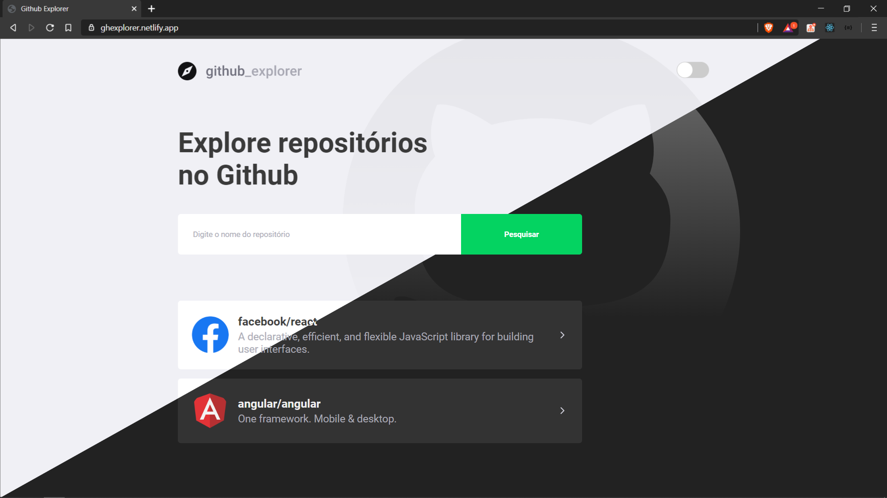

<p align="center">
  
</p>

<h3 align="center">Link para o app: https://ghexplorer.netlify.app/ </h3>

<p align="center">
  
</p>
Github Explorer, app que mostra informações de repositórios do Github, como stars, forks, issues etc.

O app foi construído no Bootcamp GoStack da Rocketseat. Mas para dar o meu próprio toque eu adicionei um Theme Switcher de tema claro para tema escuro.

## Tecnologias usadas:

- React
- Typescript
- Styled Components

## Como rodar no seu computador:
Obs: Necessário ter o NodeJS instalado e ter a porta 3000 liberada.

1. Clone o repositório
2. Entre na pasta ```github-explorer``` e rode ```npm install```
3. Quando todas as dependências estiverem instaladas, rode ```npm run start```

Pronto, a aplicação será iniciada na porta 3000!
